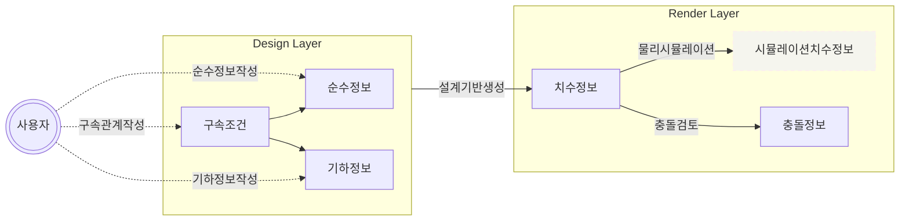

# crocheteer

**_crocheteer_** 는 웹에서 코바늘 작업을 설계할 수 있는 서비스입니다. **_crocheteer_** 는 구체적으로 다음와 같은 기능들을 제공합니다.

- 코바늘 작업의 저장과 불러오기
- 코바늘 작업의 설계와 편집
- 코바늘 작업의 단순화 렌더링(도안)부터 사실적인 렌더링까지의 지원
- 코바늘 작업의 공유

# 개념

## 코바늘 설계의 표현형

**_crocheteer_** 에서 코바늘 작업물을 표현하기 위해서는 크게 세 가지 정보가 필요합니다.

### 순수정보(`core`)

코바늘 작업물들은 각 코의 종류와 서로간의 연결관계 만으로도 결과물의 형상이 대부분 결정지어집니다. 즉, 각 코와 그 연결관계 정보가 코바늘 작업물을 구성하는 가장 핵심적이면서도 순수한 정보라고 할 수 있으며, 이를 _crocheteer_ 에서는 **_순수정보_** 라고 정의합니다.

하지만, 이런 순수정보만으로는 bistable 한 설계의 형태를 결정할 수 없습니다. 또한 실제 작업물의 경우 같은 코라고 해도 코의 길이가 늘어나고 줄어들기도 하며, 숙련된 작업자의 경우 이를 이용해 더 잘 마감된 결과물을 만들어내기도 합니다. 따라서 코바늘 작업물의 형상을 결정적으로 표현하기 위해서는 순수정보에 더해 추가적인 정보가 필요합니다.

### 구속조건(`constraint`), 그리고 기하정보(`geometry`)

코바늘 작업물의 한 코는 코의 종류와 연결관계로만 구성되지만, 여러 코가 모이면 작업자가 의도한 어떤 모양을 그려내게 됩니다. **_구속조건_** 과 **_기하정보_** 는 코바늘 작업물의 형상에 대한 작업자의 이상적인 목표를 나타내는 정보입니다.

기하정보는 일반적인 기하학적 형상에 대한 정보입니다. 코바늘 작업에 대한 정보는 가지고 있지 않죠. 그리고 구속조건이 기하정보와 각 코를 연결합니다. 구속조건을 통해 특정 코가 어느 위치에 있어야 하는지, 특정 코들의 배열이 어떤 기하학적 형태를 그려야하는지를 나타낼 수 있습니다. 순수정보와 기하정보를 구속조건을 통해 연결하면 코바늘 작업물의 형상을 결정적으로 표현할 수 있습니다.

### 치수정보(`dimension`)

**_치수정보_** 는 코바늘 작업물의 형상을 렌더링하기 위해 필요한 기하적인 좌표 정보를 의미합니다. 치수정보는 순수정보, 기하정보, 그리고 구속조건의 조합으로부터 도출됩니다.

## crocheteer 의 정보 흐름

### 각 정보의 충돌(`deviation`)

순수정보와 구속조건만으로 완벽할 것 같지만, 작업자의 설계가 물리적으로 불가능하거나 순수정보로는 설계의도를 따라가지 못할 수도 있습니다. 또한, 작업에 불가능한 것은 아니지만 구속조건와 실제 작업 결과(=치수정보)의 오차 역시 존재할 수 있습니다.

### 정보 흐름

정보의 충돌 문제를 해결하기 위해서는 각 정보들의 관계를 어떻게 관리할 것있지 정보 흐름에 대한 설계가 필요합니다. **_crocheteer_** 는 아래와 같은 형태로 정보 흐름을 관리합니다.

**_crocheteer_** 의 데이터 구조상 기하정보와 순수정보는 독립적입니다. 사용자는 서비스의 사용자 인터페이스를 통해 기하정보와 순수정보를 생성하고, 그 둘의 구속관계인 구속조건을 생성합니다. 이 과정은 세 가지 정보의 생성이라는 단계로 이루어지지만 사용자가 세번씩 일해야한다는 뜻은 아닙니다. 실제 서비스에서는 한가지 상호작용만 일어나도 프로그램이 세가지 단계를 한번에 처리할 수 있습니다. 이 세 정보는 서로 독립적이므로 수정 역시 독립적으로 이루어질 수 있습니다. 여기까지가 **_디자인 레이어_** 입니다. 각 코들의 연결관계와 목표형상 등, 사용자의 _의도_ 를 담고 있습니다.

다음은 **_랜더 레이어_** 입니다. **_crocheteer_** 는 디자인 레이어의 정보들을 토대로 치수정보를 생성합니다. 여기까지는 완벽하게 사용자의 의도대로 설계된 결과물만을 나타냅니다. 치수정보 생성 이후에는 충돌을 검토합니다. 생성된 치수정보가 코바늘 뜨기의 물리적 한계나 지정된 공차를 벗어나지 않는지 확인합니다. 검토 결과는 사용자 인터페이스에 별도로 표기합니다. 이에 더해 **_crocheteer_** 는 물리 시뮬레이션도 (_어쩌면 먼 미래에_)제공할 수 있습니다. 생성된 치수정보를 경계조건으로 물리시뮬레이션을 실행해 이상적이지 않은, 설계로부터는 조금 다르지만 실제 작업물이 가지게 될 가능성이 높은 치수정보를 도출할 수 있습니다. 이 모든 정보들은 코바늘 설계를 시각적으로 _표현하고 예측하기_ 위한 정보들을 담고 있습니다.
